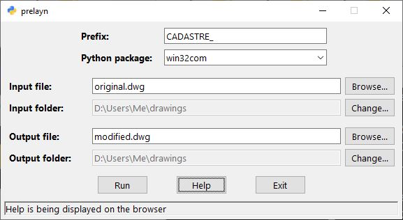

# prelayn
[](https://www.gnu.org/licenses/gpl-3.0)
[](https://www.python.org/downloads/release/python-3120/)

Application for automatically *PRE*fixing *LAY*er *N*ames of AutoCAD drawings. This task can be performed using four different approaches:

- `win32com` ([`pywin32`](https://github.com/mhammond/pywin32))
- [`pyautocad`](https://github.com/reclosedev/pyautocad)
- [`pyautogui`](https://github.com/asweigart/pyautogui)
- [`ezdxf`](https://github.com/mozman/ezdxf)

## Installation

1. Clone this repository:
```console
C:\Users\Me>git clone https://github.com/tonechas/prelayn.git
C:\Users\Me>cd prelayn
```

2. Create a virtual environment:
```console
C:\Users\Me\prelayn>python -m venv myvenv
```

3. Activate the virtual environment:
```console
C:\Users\Me\prelayn>myvenv\Scripts\activate
```

4. Install the dependencies:
```console
(myvenv) C:\Users\Me\prelayn>pip install -r requirements.txt
```

## Usage
To run the application, execute the following command:
```console
(myvenv) C:\Users\Me\prelayn>python src\prelayn.py
```

After that, a graphical user interface will pop up, boasting a help button that make the program easy to use.



## Platform support

The project supports the following operating systems:

| Operating System | Supported |
|------------------|-----------|
| Windows          | Yes       |
| Mac OS           | No        |
| Linux            | No        |
| Other Unix-like  | No        |

## Compatibility
The project has been developed and tested on a Windows 10 Pro OS using Python 3.12.0 and AutoCAD 2023.
